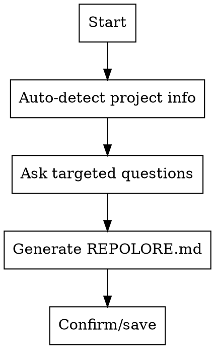

# Repolore Init

Initialize Repolore by creating a `REPOLORE.md` configuration file that helps other Repolore skills generate better content from your git commits.

## Overview

Repolore skills transform git history into blog posts, social media, changelogs, and newsletters. The `REPOLORE.md` file provides project context—tone, audience, key features—so generated content sounds like you, not generic AI output.

**Core principle:** Context beats prompts. A well-configured REPOLORE.md means better content with less editing.

## When to Use

- Setting up Repolore for the first time on a project
- Creating or updating `REPOLORE.md`
- Adding Repolore to an existing repository
- Changing project branding, tone, or target audience

## Quick Reference

| Task | Command |
|------|---------|
| Initialize Repolore | `Initialize repolore for this project` |
| Update config | `Update my REPOLORE.md` |
| Check config | `Read REPOLORE.md` |

## Workflow



## Implementation

When the user asks to initialize Repolore:

### 1. Auto-detect Project Information

Use Bash and Read tools to gather:

**Project name:**
```bash
# Check common sources
[ -f package.json ] && cat package.json | grep '"name"' | head -1
[ -f Cargo.toml ] && cat Cargo.toml | grep '^name' | head -1
[ -f pyproject.toml ] && cat pyproject.toml | grep '^name' | head -1
```

**Language/framework:**
```bash
# Detect from files
ls package.json Cargo.toml pyproject.toml go.mod requirements.txt 2>/dev/null
```

**Existing README:**
```bash
cat README.md 2>/dev/null || cat readme.md 2>/dev/null || echo "No README found"
```

**Git repository info:**
```bash
git remote -v 2>/dev/null | head -1
git log --oneline -5 2>/dev/null
```

### 2. Ask Targeted Questions

Only ask for information not found in auto-detection:

**Required (if not detected):**
- Project name
- Brief description (1-2 sentences about what it does)
- Desired tone (provide options: technical_but_accessible, professional, casual, enthusiastic, authoritative)
- Target audience (developers, end_users, technical_founders, open_source_maintainers, specific_niche)
- 3-5 SEO pillars (key topics/themes for content)

**Optional (always ask, can skip):**
- Twitter/X handle
- dev.to tags
- Newsletter author name
- Key features (suggest based on code structure if possible)
- Brand voice description (how you want to sound)

### 3. Generate REPOLORE.md

Create file with proper YAML frontmatter and markdown sections:

```yaml
---
project: [Detected/Provided Name]
tone: [selected_tone]
audience: [selected_audience]
seo_pillars:
  - [pillar_1]
  - [pillar_2]
  - [pillar_3]
twitter_handle: "[optional_handle]"
devto_tags:
  - [tag1]
  - [tag2]
newsletter_from: "[optional_name]"
---

# Project Context

[Project description from user or README]

# Key Features

- [Feature 1]
- [Feature 2]
- [Feature 3]

# Target Audience

[Description of ideal reader/user]

# Brand Voice

[How the project should sound]
```

### 4. Confirm and Save

1. Present the generated content to the user
2. Ask for confirmation or edits
3. Use Write tool to save to `REPOLORE.md`
4. Confirm completion with file path

## Example Output

```yaml
---
project: Repolore
tone: technical_but_accessible
audience: developers
seo_pillars:
  - agentic skills
  - content generation
  - developer productivity
  - git workflows
twitter_handle: "@repolore"
devto_tags:
  - javascript
  - ai
  - productivity
newsletter_from: "Repolore Team"
---

# Project Context

Repolore is a collection of agentic skills that transform git commits into blog posts,
tweets, LinkedIn updates, changelogs, and more. It helps developers share their work
without the content creation overhead.

# Key Features

- Multiple content formats (blog, X, LinkedIn, Reddit, changelog, dev.to, newsletter)
- Git commit analysis for context-aware generation
- REPOLORE.md configuration for consistent brand voice
- Easy installation via curl command

# Target Audience

Indie developers, open source maintainers, and technical founders who want to
share their work but struggle with content creation.

# Brand Voice

Technical but accessible. We explain complex topics simply without dumbing them
down. Professional but not corporate. We sound like a smart colleague explaining
something over coffee.
```

## Common Mistakes

| Mistake | Fix |
|---------|-----|
| Skipping optional fields | Include them—empty fields don't hurt, missing context does |
| Generic SEO pillars | Be specific: "react hooks" not "programming" |
| Vague brand voice | Use concrete comparisons: "like X but Y" |
| Too many features | Keep to 3-5 most important |

## Tools Used

- `Bash` - Detect project info from package files and git
- `Read` - Extract content from existing README/package.json
- `Write` - Save the generated REPOLORE.md
- `AskUserQuestion` - Collect missing information
